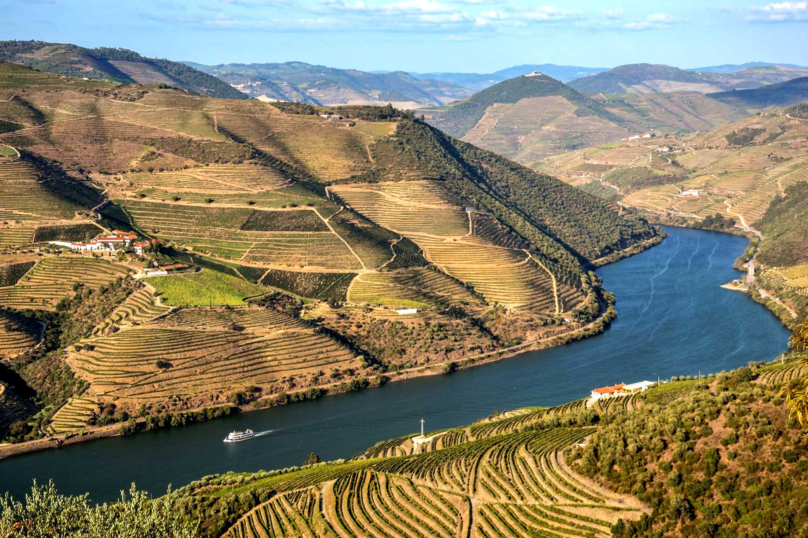
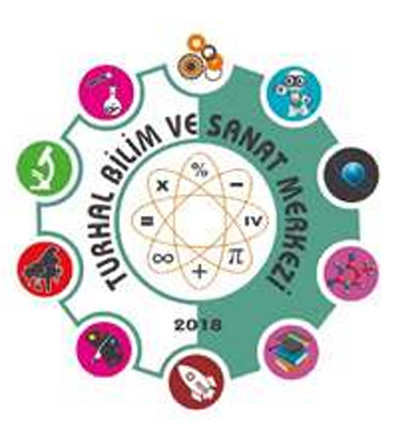
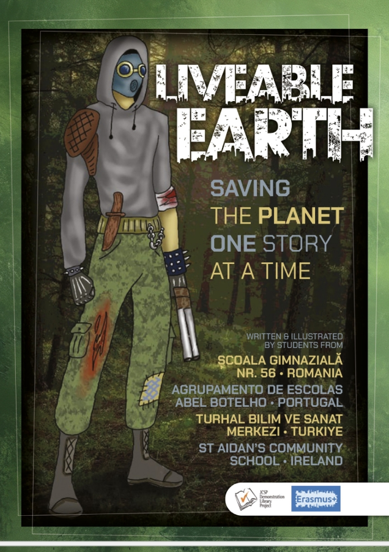
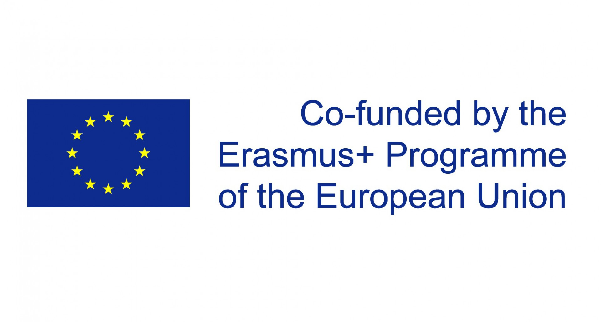

<link rel="icon" type="image/png" href="assets/images/favicon.png">

# 🌱 Blooming Digital  
## Enriching Lives, Opening Minds – *Liveable Earth*
---

  
  
  

    Blooming Digital: Enriching Lives, Opening Minds
  

---

Welcome to our Erasmus+ project website!  
This space is dedicated to showcasing the collaborative work of students and teachers across Europe, exploring sustainability, creativity, and digital tools.

---

## 🌍 What is Blooming Digital?

**Blooming Digital: Enriching Lives, Opening Minds** is a collaborative Erasmus+ project uniting students and teachers across Europe to explore the intersection of sustainability, culture, and digital innovation.

Over the course of several months, schools from **Portugal, Ireland, Romania, and Türkiye** worked together on creative and educational activities centered around the theme of a **Liveable Earth**. The project empowers students to think critically about environmental issues while developing essential digital and intercultural skills.

**Blooming’** calls to mind nature and the environment; The theme for all the digital artefacts to be created throughout the project is **‘sustainability’**.

From interactive workshops and podcasts to student-designed booklets, Blooming Digital celebrates diversity, creativity, and the power of international collaboration in education.

  

    

      
    

    

      
    

    

      
    

    

      
    

  

  

    
    
    
    
  

## 🎓 Look at the amazing work of our students!

  <input type="radio" name="slider" id="slide1" checked style="display: none;">
  <input type="radio" name="slider" id="slide2" style="display: none;">
  <input type="radio" name="slider" id="slide3" style="display: none;">
  <input type="radio" name="slider" id="slide4" style="display: none;">
  <input type="radio" name="slider" id="slide5" style="display: none;">

  

    

      <!-- Slide 1: Spotify -->
      

        <iframe style="border-radius:12px" 
          src="https://open.spotify.com/embed/show/0VX7Q2XRQ1vbJ6FQwVwPUs?utm_source=generator" 
          width="100%" height="152" frameborder="0" allowfullscreen="" 
          allow="autoplay; clipboard-write; encrypted-media; fullscreen; picture-in-picture" loading="lazy">
        </iframe>
        
<strong>🎧 Listen to our Podcast!</strong>

      

      <!-- Slide 2: PDF Booklet -->
      

        
        
<strong>📘 Click to download the student booklet</strong>

      

      <!-- Slide 3: Short film -->
      

        <iframe width="100%" height="300" src="https://www.youtube.com/embed/aGex186Uz3A" 
          title="Short film about Livable Earth" frameborder="0" allow="accelerometer; autoplay; clipboard-write; encrypted-media; gyroscope; picture-in-picture" allowfullscreen>
        </iframe>
        
<strong>🎬 Short film about Livable Earth</strong>

      

      <!-- Slide 4: Web App Workshop -->
      

        <iframe width="100%" height="300" src="https://www.youtube.com/embed/IsTd0S4hXU4" 
          title="Workshop about web app creation" frameborder="0" allow="accelerometer; autoplay; clipboard-write; encrypted-media; gyroscope; picture-in-picture" allowfullscreen>
        </iframe>
        
<strong>💻 Workshop about web app creation</strong>

      

      <!-- Slide 5: Local video -->
      

        <video width="100%" height="300" controls>
          <source src="assets/slideshow de fotos.mp4" type="video/mp4">
          Your browser does not support the video tag.
        </video>
        
<strong>📸 Students collaborating in action</strong>

      

    

  

  <!-- Navigation Dots -->
  

    <label for="slide1" style="cursor: pointer; margin: 0 5px;">⬤</label>
    <label for="slide2" style="cursor: pointer; margin: 0 5px;">⬤</label>
    <label for="slide3" style="cursor: pointer; margin: 0 5px;">⬤</label>
    <label for="slide4" style="cursor: pointer; margin: 0 5px;">⬤</label>
    <label for="slide5" style="cursor: pointer; margin: 0 5px;">⬤</label>
  

---

## 📢 Project Dissemination

As part of our Erasmus+ initiative, project partners actively disseminated the outcomes of Blooming Digital through educational platforms, conferences, and social media. Explore more below:

- 🔗 [Media & Learning Conference](https://conference.media-and-learning.eu/)
- 🔗 [Scoala 56 Erasmus Page](https://scoala56.ro/erasmus/)
- 🔗 [Agrupamento de Escolas de Tabuaço](https://agrupamento-tabuaco.com/projetos-europeus/erasmus/)
- 🔗 [Facebook Highlights](https://www.facebook.com/share/p/1A1MAwCypk/?mibextid=wwXIfr)

---

  
  

    Funded by the Erasmus+ Programme of the European Union
  

